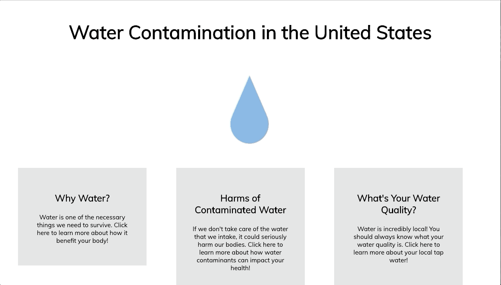
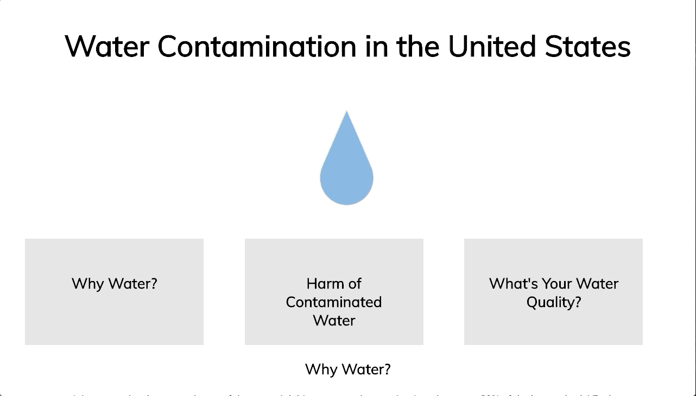
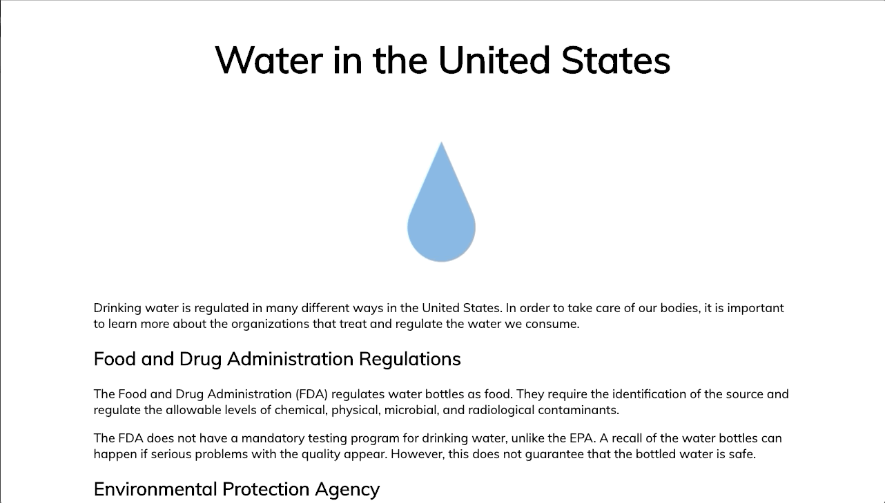

# Water Contamination in the United States

A website that educates US residents on the contamination of their drinking water. It provides information on why water is important for the body, how the contaminants in drinking water can affect one's health, and how contaminated their drinking water can be. It also features common solutions to decrease the amount of contaminants in water, how race and socioeconomic status play a role in water quality, and how drinking water is regulated in the United States.

# Tech Stack

All of the images were created using Google Drawings

# Landing Page

# Why Water?

# Harm of Contaminated Water

# What's Your Water Quality?

# Solutions and Common Misconceptions 

# Water in the United States 

# Case Studies 
! [Case Studies Page](gifs/caseStudies.gif)
